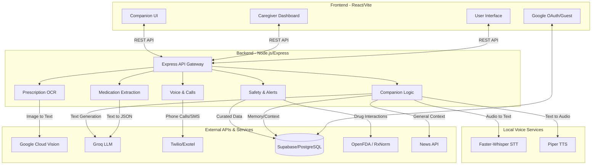

# Saya.ai - Autonomous Elder Care Companion

## Architecture Diagram

## Modules Developed

1. **Authentication & Onboarding**: Supports Google OAuth and Guest login.
2. **Dashboard**: Caregiver portal for patient monitoring, alert resolution, and schedule tracking.
3. **Prescription Processing**: 
   - **OCR Module**: Extracts raw text from prescription images using Google Cloud Vision.
   - **NER Module**: Uses Groq LLMs to parse raw text into structured medication schedules.
4. **Safety & Compliance**: Cross-checks medications with OpenFDA, RxNorm, and curated Indian drug interaction databases. Implements caregiver-in-the-loop verification.
5. **Companion Chat**: Autonomous AI companion with patient memory, emotional tracking, and context-awareness via News API integrations.
6. **Voice & Telephony**: Call scheduling, medication reminders via IVR, and SMS alerts. Integrates local STT/TTS for seamless interactions.

## Data Flow

1. **Prescription Upload**: Caregiver uploads a prescription -> Backend sends image to **Google Cloud Vision** (OCR) -> Extracted text goes to **Groq LLM** (NER) -> Parsed medication schedule is stored in **Supabase** (Pending Verification).
2. **Caregiver Verification**: Caregiver reviews the extracted schedule -> Approves -> Triggers safety checks via **OpenFDA/RxNorm** -> If safe, schedule becomes active.
3. **Medication Reminder**: Scheduled Job checks active schedules -> Initiates call via **Twilio** -> Uses **Piper TTS** to speak -> Captures response via **Twilio/Faster-Whisper STT** -> Logs confirmation in Supabase.
4. **Companion Interaction**: Elderly patient interacts with companion -> Audio/Text sent to backend -> **Faster-Whisper STT** transcribes -> **Groq LLM** generates response using patient's history (Supabase) + Current events (NewsAPI) -> **Piper TTS** synthesizes voice -> Audio played back to the patient.

## Key Functionalities

- **Automated Prescription Digitization**: High-accuracy OCR + NLP extraction for complex medical documents.
- **Caregiver-in-the-Loop Safety**: No medication starts without explicit caregiver approval.
- **Strict Medical Constraints**: Medical facts are strictly pulled from verified databases, never hallucinated by LLMs.
- **Proactive Calling**: Automated IVR calls to patients for medicine reminders and check-ins.
- **Empathetic Companion**: Conversational AI designed to combat loneliness, tagged with sentiment analysis to escalate negative emotions to caregivers.
- **Multi-Modal Interaction**: Unified experience across Text interfaces and low-latency voice capabilities.

## Tech Stack Used

- **Frontend**: React (Vite), Tailwind CSS, Radix UI components, Framer Motion, Lottie.
- **Backend**: Node.js, Express, TypeScript, Bull (Job Queues), Zod (Validation).
- **Database**: Supabase (PostgreSQL, Auth, Storage).
- **AI & NLP**: Groq (Llama models), Google Cloud Vision API.
- **Voice & Telephony**: Twilio, Piper TTS (Local), Faster-Whisper STT (Local).
- **External Data**: News API, OpenFDA, RxNorm.

## Challenges Faced and Solutions

- **Challenge**: Accurately parsing handwritten and poorly formatted Indian prescriptions.
  - **Solution**: Layered approach: Used Google Cloud Vision for robust base OCR, followed by Groq's LLM specifically prompted for NER (Named Entity Recognition) to correctly structure dosages and frequencies.
- **Challenge**: Eliminating dangerous AI hallucinations in medical advice.
  - **Solution**: Implemented strict safety invariants. The LLM is restricted from giving medical advice. All drug warnings and facts are fetched deterministically from curated Supabase records or official FDA APIs.
- **Challenge**: High latency in voice interactions causing poor UX for the elderly.
  - **Solution**: Integrated local, optimized models (`faster-whisper` for STT and `Piper` for TTS) instead of relying purely on cloud services, drastically reducing round-trip response times.

## Optimizations Made

- Deployed local inference for STT/TTS to reduce cloud API latency and operational costs.
- Utilized Vite for rapid frontend bundling and optimized React component rendering with code splitting.
- Implemented robust rate limiting, timeout handling, and request ID tracking in the backend middleware for high reliability and debugging.
- Designed Supabase schemas with proper indexing to ensure fast retrieval of companion chat history and medication schedules.

## Output Achieved

Delivered a fully functional, end-to-end prototype that successfully digitizes prescriptions, schedules and executes automated voice reminders, and provides a low-latency, empathetic AI companion capable of escalating safety concerns to caregivers.

## Real World Applications

- **Elderly Care Facilities**: Automating medication adherence tracking across multiple residents.
- **Independent Seniors**: Providing a reliable companion and reminder system for those living alone.
- **Post-Operative Care**: Assisting patients in strictly following complex short-term medication schedules after discharge.

## Future Improvements

- **Regional Language Support**: Expanding the local STT and TTS models to support multiple Indian regional languages (Hindi, Marathi, Bengali, etc.).
- **IoT Integration**: Syncing with smartwatches or health monitors to track vitals and adjust companion interactions based on real-time health data.
- **Advanced Predictive Analytics**: Analyzing the companion chat logs over time to detect early signs of cognitive decline or severe depression.
- **Family Group Chat**: Allowing multiple family members to be in the loop and verify prescriptions collaboratively.
